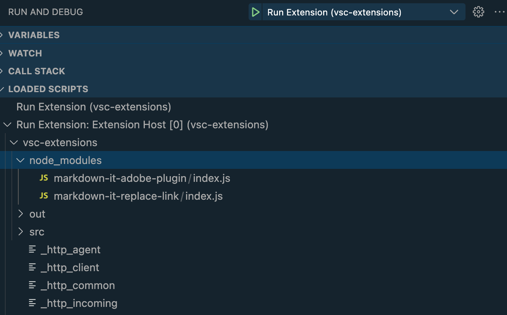

# markdown-it-adobe-plugin

A [markdown-it](https://github.com/markdown-it-markdown-it#readme) plugin to support rendering Adobe Flavored Markdown to HTML.

## Installation

node.js

```bash
$ yarn add markdown-it-adobe-plugin
yarn add v1.22.17
info No lockfile found.
[1/4] 🔍  Resolving packages...
[2/4] 🚚  Fetching packages...
[3/4] 🔗  Linking dependencies...
[4/4] 🔨  Building fresh packages...
success Saved lockfile.
warning Your current version of Yarn is out of date. The latest version is "1.22.19", while you're on "1.22.17".
info To upgrade, run the following command:
$ curl --compressed -o- -L https://yarnpkg.com/install.sh | bash
success Saved 1 new dependency.
info Direct dependencies
└─ markdown-it-adobe-plugin@1.1.2
info All dependencies
└─ markdown-it-adobe-plugin@1.1.2
✨  Done in 1.25s.
```

## Supported Markdown extensions

This plugin supports converting the following Adobe Flavored Markdown (AFM) tags from Markdown to HTML:

### Alerts and Admonitions

- [!NOTE]
- [!CAUTION]
- [!IMPORTANT]
- [!TIP]
- [!WARNING]
- [!ADMIN]
- [!AVAILABILITY]
- [!PREREQUISITES]
- [!MORELIKETHIS]

### Video

- [!VIDEO]

### User Interface Localization

- [!DNL]
- [!UICONTROL]

### Heading Anchors

This plugin also converts AFM heading anchor suffixes into IDs for anchoring HTML links.

```Markdown
# This is a heading with an anchor at the end {#heading-anchor-tag}
```

renders

```html
<h1 id="heading-anchor-tag">This is a heading with an anchor at the end</h1>
```

### Note Markup with blank line

```Markdown
>[!NOTE]
>
>This is note text.
```

Returns

```html
<div class="extension note" data-label="NOTE">
<div class="p"></div>
<div class="p">This is note text.</div>
</div>
```

### Note markdown without blank line

```Markdown
>[!NOTE]
>This is note text.
```

renders

```html
<div class="extension note" data-label="NOTE">
<div class="p">This is note text.</div>
</div>
```

### Tip Markup

```Markdown
>[!TIP]
>
>Here is a one-line tip. 
```

renders

```html
<div class="extension tip" data-label="TIP">
<div class="p"></div>
<div class="p">Here is a one-line tip.</div>
</div>
```

### Important Markup

```Markdown
>[!IMPORTANT]
>
>Here is a one-line important message. 
```

renders

```html
<div class="extension important" data-label="IMPORTANT">
<div class="p"></div>
<div class="p">Here is a one-line important message.</div>
</div>
```

### Warning Markup

```Markdown
>[!WARNING]
>
>Here is a one-line warning. 
```

renders

```html
<div class="extension warning" data-label="WARNING">
<div class="p"></div>
<div class="p">Here is a one-line warning.</div>
</div>
```

### Caution Markup

```Markdown
>[!CAUTION]
>
>Here is a one-line caution. 
```

renders

```html
<div class="extension caution" data-label="CAUTION">
<div class="p"></div>
<div class="p">Here is a one-line caution.</div>
</div>
```

### Invalid alert markup label

```Markdown
>[!ERROR]
>
>Here is unsupported alert markup. It should be unlabeled and just output a plain blockquote.
```

renders

```html
<blockquote>
<div class="p">[!ERROR]</div>
<div class="p">Here is unsupported alert markup. It should be unlabeled and just output a plain blockquote.</div>
</blockquote>
```

### Some more complex markup that contains plain and extended blockquotes

```Markdown
# Ordinary Blockquote
Here is an ordinary block quote:
>
> To err is human.  
>
## Followed by a multi-line tip
>[!TIP]
>
> Make sure that everybody understands that tipping is necessary. Especially
> in these weird times in which we live. 
> 
> -- Rev. Dr. Martin Luther King, JR
```

renders

```html
<h1>Ordinary Blockquote</h1>
<p>Here is an ordinary block quote:</p>
<blockquote>
<div class="p">To err is human.</div>
</blockquote>
<h2>Followed by a multi-line tip</h2>
<div class="extension tip" data-label="TIP">
<div class="p"></div>
<div class="p">Make sure that everybody understands that tipping is necessary. Especially
in these weird times in which we live.</div>
<div class="p">-- Rev. Dr. Martin Luther King, JR</div>
</div>
```

### VIDEO tag

```Markdown
>[!VIDEO](https://video.tv.adobe.com/v/17187/)
```

renders

```html
<div class="extension video">
<iframe class="p" allowfullscreen="true" embedded-video="true" style="position: absolute; top: 0; left: 0; width: 100%;" src="https://video.tv.adobe.com/v/17187/"></iframe>
</div>
```

### MORELIKETHIS tag

```Markdown
>[!MORELIKETHIS]
>
>- [Adobe Experience League](https://experienceleague.adobe.com)
>- [Markdown-It Extension](https://github.com/markdown-it/markdown-it)
>- [Microsoft Docs Authoring Extension](https://docs.microsoft.com/en-us/contribute/how-to-write-docs-auth-pack)
```

renders

```html
<div class="extension morelikethis" data-label="MORELIKETHIS">
<div class="p"></div>
<ul>
<li><a href="https://experienceleague.adobe.com">Adobe Experience League</a></li>
<li><a href="https://github.com/markdown-it/markdown-it">Markdown-It Extension</a></li>
<li><a href="https://docs.microsoft.com/en-us/contribute/how-to-write-docs-auth-pack">Microsoft Docs Authoring Extension</a></li>
</ul>
</div>
```

### DNL tag in paragraph

```Markdown
Here is just a plain paragraph with [!DNL Unlocalized] text in it. 
```

renders

```html
<p>Here is just a plain paragraph with Unlocalized text in it.</p>
```

### DNL tag in header

```Markdown
# [!DNL Do Not Localize] the preceding string
```

renders

```html
<h1>Do Not Localize the preceding string</h1>
```

### UICONTROL tag in paragraph

```Markdown
Here is just a plain paragraph with [!UICONTROL localized] text in it. 
```

renders

```html
<p>Here is just a plain paragraph with localized text in it.</p>
```

### UICONTROL tag in header

```Markdown
# [!UICONTROL Should be localized] the preceding string
```

renders

```html
<h1>Should be localized the preceding string</h1>
```

## API

```js
var md = require('markdown-it')()
            .use(require('markdown-it-adobe-plugin'));
```

The plugin does not require or use any parameters.

## Example

```js
var md = require('markdown-it');
var adobePlugin = require('markdown-it-adobe-plugin');

var parser = md().use(adobePlugin);

var str = `# Ordinary Blockquote
Here is an ordinary block quote:
>
> To err is human.  
>
## Followed by a multi-line tip
>[!TIP]
>
> Make sure that everybody understands that tipping is necessary. Especially
> in these weird times in which we live. 
> 
> -- Rev. Dr. Martin Luther King, JR`

var result = parser.render(str);

console.log(result);

// <h1>Ordinary Blockquote</h1>
// <p>Here is an ordinary block quote:</p>
// <blockquote>
// <div class="p">To err is human.</div>
// </blockquote>
// <h2>Followed by a multi-line tip</h2>
// <div class="extension tip" data-label="TIP">
// <div class="p"></div>
// <div class="p">Make sure that everybody understands that tipping is necessary. Especially in these weird times in which we live.</div>
// <div class="p">-- Rev. Dr. Martin Luther King, JR</div>
// </div>
```

## Debugging in Visual Studio Code

This module is a plug-in for Markdown-It.  To debug it in VS Code, you need to debug the Extension that loads 
Markdown-It, which in turn loads this module.

See 

## License

[Apache-2.0](https://bitbucket.org/oproma/markdown-it-adobe-plugin/src/master/LICENSE)
